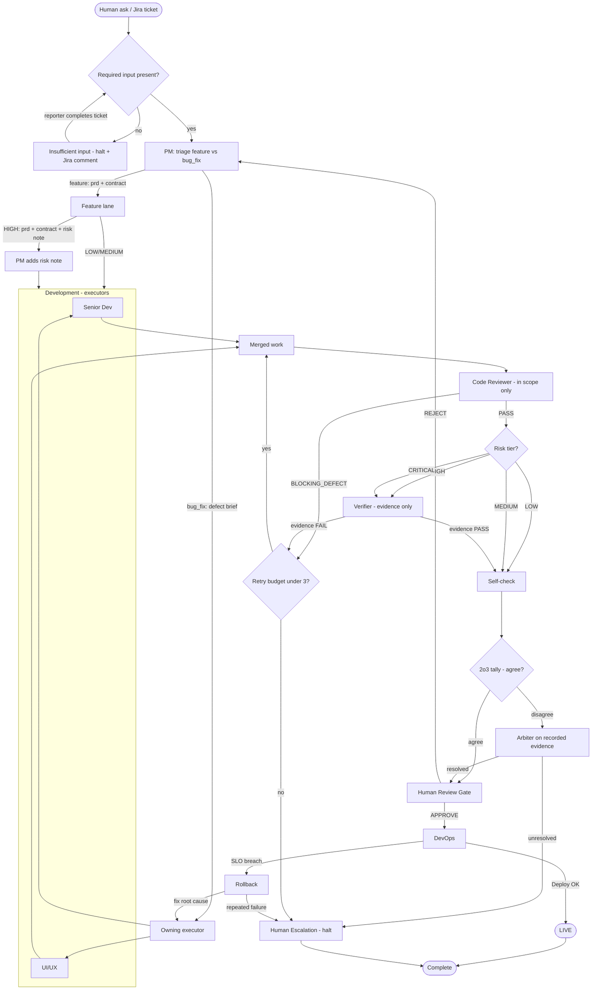

## Reading the diagram
- **Intake gate:** a Jira ticket missing required fields (`repro_steps`,
  `expected`/`actual`, `severity` — see `references/schemas/jira-ticket.schema.md`)
  is **blocked** as `insufficient_input`: the orchestrator halts, posts a
  `jira_update/v1` comment asking the reporter to complete the ticket, and
  dispatches nothing. No agent guesses. Work resumes automatically when the
  completed ticket re-enters the check. (A free-form human ask passes trivially.)
- **Two intake lanes:** a free-form feature ask becomes a PRD + Interface
  Contract; a Jira ticket becomes a Defect Brief routed to the single owning
  executor. Both converge at **Merged work** and share the same validation tail —
  a bug fix is a PR.
- **Reviewer stays in scope:** only `BLOCKING_DEFECT` findings return work to an
  executor; `OUT_OF_SCOPE`/`FOLLOW_UP` never block (review-scope rule, see
  `references/2o3-protocol.md`).
- **2o3 is a protocol, not three permanent agents:** the reviewer always runs for
  non-trivial work; the **verifier** (evidence-only voter) joins at HIGH/CRITICAL.
  A disagreement goes to the **arbiter** on recorded evidence; an unresolved
  disagreement escalates to a human.
- **Human Review Gate:** nothing deploys without a recorded `APPROVE`.
- **Retry budget:** each `BLOCKING_DEFECT`/evidence-FAIL passes the "under 3?"
  check; at 3 the run halts at **Human Escalation** instead of looping.
- **Rollback:** an SLO breach rolls back to the last good release, routes to the
  owning executor for a root-cause fix, and escalates if it repeats.
